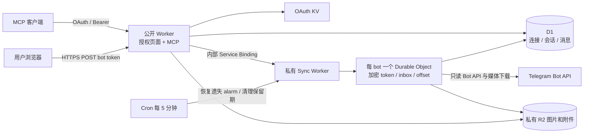

# Telegram Read-only MCP

Node.js 24 + TypeScript，使用 **Cloudflare `cf` CLI 1.0 beta** 的 `cloudflare.config.ts` / Vite 工作流。面向 Telegram 官方 Bot API，覆盖普通 bot 私聊、群聊、频道以及 Business / Secretary 会话。不是 MTProto 个人账号客户端。

## 已实现

- 自有授权页面：提交 bot token → `getMe` 验证 → 直接完成 OAuth authorization code + PKCE S256 → MCP access token。无需选择会话；一次授权覆盖该 bot 当前及未来可接收的全部会话。
- Cloudflare OAuth Provider 负责令牌散列存储、refresh rotation、CIMD、兼容 DCR、资源 audience 校验。应用另外校验只读 scope 和租户权限。
- 6 个 MCP 工具：`list_chats`、`get_messages`、`search_messages`、`get_sync_status`、`get_image`、`get_file`。
- `get_messages` 与 `search_messages` 支持可选的 `start_time` / `end_time`，按消息原始发送时间查询指定区间。
- 每 bot 一个 Durable Object，后台 long polling、加密 inbox、编辑更新、删除 tombstone、重复处理、失败退避、429 `retry_after`、401 撤销、409 停止冲突轮询。
- 管理页面支持撤销全部 MCP 授权、暂停/恢复同步、删除全部服务数据。
- 正文、图片和普通附件统一从原消息发送时间起保留 90 天；图片与附件原文件存储在私有 R2，仅可经 MCP 鉴权读取。支持中文及字面子串搜索，不使用外部向量库或 AI API。

## 架构与权限边界



公开 Worker 的生产 bindings **没有 `BOT_KEYS`**，D1 不存 bot token。凭证和临时 inbox 使用 AES-256-GCM，随机 nonce，AAD 绑定安装/bot，密钥只绑定私有 Sync Worker。这个 Worker 关闭 workers.dev / preview URL，通过内部服务绑定调用。

MCP 每次请求从经过验证的授权 props 得到 `installationId + access:"bot" + epoch`，不会再次向 Telegram 查询 bot 身份。所有查询始终由授权中的 `installation_id` 限定 bot；`source_key + chat_id` 区分普通 bot 与不同 Business connection 的重叠聊天 ID。每个 MCP 请求、工具调用重查安装 epoch / 状态，并在 SQL 内过滤已撤销的 Business 连接和已知退出的群。旧的 connection 级 grant 不包含新的 `access:"bot"`，必须重新授权，不能自动扩大读取权限。

**Bot token 本身不是官方的只读 token。** 服务只实现 `getMe/getWebhookInfo/getBusinessConnection/getUpdates/getFile`；即使 bot 在 Telegram 中具有发送或管理权限，本服务也不会调用写入方法。Business 模式不是普通 bot 的接入前提；Business 的操作权限仅记录状态，不作为读取消息的条件。仍建议在 Telegram 侧只授予所需的最少权限。已知 Business 连接会定期复查是否启用，并处理连接 / 成员状态更新；Telegram 侧撤销不是零延迟通知。

## 本地开发

```bash
npm ci
npm run setup:local
npm run db:migrate:local
npm run dev
```

打开 `http://localhost:5173`。MCP endpoint 为 `http://localhost:5173/mcp`。`cf dev` 同时启动公开 Worker、内部同步 Worker、D1、KV、R2、DO。本地数据目录为 `.cloudflare/state`。迁移与 Vite 使用同一路径。

`setup:local` 创建随机加密密钥到被 Git 忽略的 `.dev.vars`，不会覆盖已有文件或打印密钥。浏览器 cookie 使用 Secure / HttpOnly，HTTP 开发只面向浏览器认可的 localhost，不要用非 loopback 的明文地址。

```bash
npm run typecheck
npm test
npm run build
# 或全部执行：
npm run check
```

测试在 workerd 中运行，使用真实 D1、KV、R2、Durable Objects 与 OAuth/MCP 库；仅 Telegram 网络响应被模拟，不需要提供真实 token。兼容日期固定为 `2026-08-22`，匹配当前测试池自带的 workerd；生产和测试保持一致。`cf` 的当前 beta 构建可能额外打印 Docker daemon 探测提示，本项目不使用 Containers。

## Telegram 接入

1. 在 BotFather 创建自己的专用 bot。普通群聊和频道不要求启用 Business 模式。
2. 群聊：`/setjoingroups` → Enable；`/setprivacy` → Disable。已在群中的 bot 需要移出再加入以使隐私模式设置生效；读取群消息不必授予管理员权限。频道按 Telegram 要求添加 bot。
3. 如需接入个人账号中的 Business / Secretary 会话，再启用对应模式并在 Telegram 连接该 bot、设置访问范围。
4. 不要同时配置 webhook 或运行其他 `getUpdates` 消费者。本服务不会调用 `deleteWebhook` 抢占既有服务。
5. 在 MCP 客户端添加服务 URL，输入 bot token 并点击“验证并连接”，直接返回客户端完成授权。同步从 token 验证成功后自动开始，不等待任何会话被发现。
6. 在已授权聊天中产生新消息后用 `list_chats` 查询。`get_messages` 使用返回的 `source_key` 与 `chat_id`；`search_messages` 默认搜索此 bot 的所有可访问会话。新会话不必重新授权。

这里“所有会话”是 **Telegram 实际向这个 bot 投递更新的会话**。Bot 不会自动获得个人账号参加的所有群，也没有列举未投递过更新的全部会话或拉取完整历史的 Bot API。旧连接早于服务接入且没有后续事件时，可在 Telegram 重新连接来产生更新。Bot token 证明的是 bot 控制权，持有者可授权读取这个 bot 的全部数据；不要让不互信的人共用 token。

## 按时间范围查询消息

`get_messages` 和 `search_messages` 都支持以下可选参数，省略时保持原来的查询行为：

| 参数         | 含义                                | 格式                                                     |
| ------------ | ----------------------------------- | -------------------------------------------------------- |
| `start_time` | 包含该时刻，即发送时间 ≥ 开始时间   | 整数 Unix 秒时间戳，或带时区、精确到秒的 ISO 8601 字符串 |
| `end_time`   | 不包含该时刻，即发送时间 < 结束时间 | 同上                                                     |

例如，查询某个群在 UTC+8 的 2026-09-29 全天消息（`source_key` 和 `chat_id` 使用 `list_chats` 返回的值）：

```json
{
  "source_key": "bot",
  "chat_id": "-1001234567890",
  "start_time": "2026-09-29T00:00:00+08:00",
  "end_time": "2026-09-30T00:00:00+08:00",
  "limit": 100
}
```

以上是 `get_messages` 的参数。调用 `search_messages` 时再加上 `query`，即可在同一时间范围内搜索文字、说明或附件文件名；省略 `source_key` / `chat_id` 可搜索该 bot 的全部可访问会话。

- 可以只指定开始或结束时间；同时指定时必须满足 `start_time < end_time`。
- ISO 时间必须包含秒及 `Z` 或 `+08:00` 等时区，不接受单独日期、无时区时间或小数秒。数字为秒时间戳，不是毫秒；例如 `1790611200` 等价于 `2026-09-29T00:00:00+08:00`。有效时间从 Unix epoch 到 UTC 9999 年末。
- 按原消息 `sent_at` 筛选，编辑消息不会改变所属时间范围。区间筛选先于分页；`get_messages` 仍按消息 ID 倒序并使用 `before_message_id` 翻页，`search_messages` 仍使用 `offset` / `limit`。
- 只能查询已同步且尚在 90 天保留期内的消息；时间参数不会回补 Telegram 历史或扩大授权范围。

## 使用 cf 部署

首次部署到自己的 Cloudflare 账号，请按 [cf CLI 部署指南](docs/DEPLOY_WITH_CF.md) 操作。指南包含账号登录与选择、D1 / KV / R2 创建、独立生产密钥生成、配置保存、发布验证、更新和故障排查。

已配置环境的后续更新：

```bash
npm ci
npm run deploy
```

`deploy` 自动读取 `.cloudflare/production/deployment.env`，检查私有图片桶，重新构建并应用 D1 迁移，再依次发布私有同步 Worker 和公开 MCP Worker。升级时保留原生产密钥；不要把 secret 文件上传给公开 Worker。

部署配置也可以保存在项目外，使用方式见[部署指南](docs/DEPLOY_WITH_CF.md)。首次部署时使用自己创建的资源 ID 和域名。

## 同步与恢复语义

- 同一 bot 只有一个 DO，通过串行队列防止 alarm 与 token 更新/删除并发覆盖。
- Telegram 返回的 batch 在进度推进前，先过滤禁用 Business 连接的正文并移除回复引用等多余字段，仅保留归档所需的媒体元数据与文件 ID，再加密并分块持久化 inbox。
- 每条消息通过复合主键和 `last_update` 幂等写入 D1。全部处理成功后，在 DO transaction 内提交新 offset 并删除 inbox。D1 与 DO 不做跨存储事务；如果中途崩溃，重放相同 inbox 即可。
- 删除记录保留轻量 tombstone，旧编辑/重放不会让正文复活。保留期清理把正文及显示元数据清空；ID/时间等 tombstone 元数据保留到用户删除安装，用于防重放。
- 失败指数退避，429 尊重 Telegram retry_after。watchdog 不缩短尚未到期的 alarm。401 会提升 epoch 并停止同步；409 暂停，等待管理员排除 webhook / 其他 poller 冲突后恢复。
- Telegram 更新最多暂存 24 小时，服务长时间离线可能丢失更新；没有 Bot API 历史回补。持续轮询会产生成本，适用于初期少量 bot。
- 接收普通 `message/edited_message`、`channel_post/edited_channel_post`、`my_chat_member` 以及四种 Business 更新。没有会话时仍持续等待新消息，不再因未选择连接而自动删除安装。
- 普通群聊/频道没有通用的删除消息更新，因此无法保证同步删除；其已归档正文由 90 天保留期或用户删除全部数据来清除。Business 删除更新会及时清空正文。
- `chats` 保存已发现会话的类型、名称和成员状态，元数据保留到删除安装；发现记录不等于完整 Telegram 会话目录。

## 撤销、删除、轮换

- `/manage` 输入有效 bot token 登录（10 分钟管理会话）。撤销首先提升 D1 epoch，MCP 立即拒绝旧授权，再清理 OAuth grant。暂停同步还会删除待处理 inbox。
- 删除移除 DO 凭证/inbox/进度、D1 安装/连接/消息/图片与附件索引/会话及该安装全部 R2 对象，并撤销 OAuth grant。云平台备份、D1 Time Travel 和基础设施日志的保留窗口独立于应用删除，不能承诺即时物理擦除。
- Telegram token 轮换：在 BotFather 重新生成 token，然后在本服务重新授权/管理登录。bot ID 不变时更新密文并提升 epoch，旧 MCP 授权需重新连接。
- 加密密钥轮换：把新版本加入 `BOT_KEYS`，设置部署环境变量 `ACTIVE_KEY_ID` 为新版本。新 token/inbox 写入采用新 key；原 token 需通过重新登录逐个重加密。确认全部 credential/inbox 已迁移之前，保留旧 key。当前没有自动批量 rekey 命令。

## 隐私与当前范围

- 聊天正文为了数据库查询，以应用可读形式存在 D1；D1 的平台加密不等于只有用户能解密。部署管理员和 Cloudflare 是信任边界。OAuth 客户端读取后，数据如何进入 AI 模型/保留多久取决于该客户端。
- 不记录 bot token、Authorization、请求正文或消息文本。自动 invocation logs / traces 关闭，避免 Telegram URL 路径中的 token 被 tracing 记录；仅显式输出有限错误代码。运维时不要开启会采集完整子请求 URL 的额外日志。
- 查询支持纯文本、caption 及附件文件名，图片与普通附件按下文保存；暂不解析附件正文、不下载独立的视频/语音等其他媒体，也不解析 Telegram RichMessage、语音识别、Secret Chats 或历史导入。
- 所有工具为只读，无发送、编辑、删除 Telegram 消息、标记已读、任意 Telegram API、任意 SQL。MCP tool annotations 只是提示；权限实际由固定代码路径及查询条件保证。
- SQL 子串搜索适合 MVP；大规模使用需要分库、搜索索引与预算策略。没有多地区/大负载性能验证。
- 暂不提供任意跨域浏览器直连 MCP 的 CORS；普通服务端/桌面 MCP 客户端可以使用。CIMD 与 DCR 支持客户端完成标准 OAuth。

参考：[Telegram Bot API](https://core.telegram.org/bots/api)、[Cloudflare cf CLI](https://blog.cloudflare.com/cloudflare-cf-cli-launch/)、[OAuth Provider](https://github.com/cloudflare/workers-oauth-provider)、[Cloudflare Agents MCP](https://developers.cloudflare.com/agents/model-context-protocol/)。

## 图片保存与读取

图片保存在私有 R2，通过 MCP 鉴权后读取。

- 接入后自动保存每条照片消息中分辨率最大的版本，以及作为文件发送的 JPEG、PNG、WebP、GIF；相册中的每条消息分别保存。普通文件按下节保存；独立的视频、贴纸和 RichMessage 内嵌媒体暂不保存。
- 单张最多 20,000,000 字节，下载过程中也检查真实字节数，并校验图片文件头；不信任扩展名或上传者声明的 MIME。超过上限会返回 `image_status: skipped`，无效图片为 `failed`。
- `get_messages` / `search_messages` 返回 `image_id`、`image_status`、`image_mime_type`、`image_bytes`、`image_error`。`pending` 表示排队/重试，`ready` 后调用 `get_image({image_id})` 返回 MCP 图片内容。
- R2 没有公开链接；Token、Telegram 文件 URL、Telegram file_id、对象 key 不交给 MCP 客户端。待下载的 file_id 在 D1 中以 AES-GCM 加密，成功或永久失败后移除。图片使用 R2 平台静态加密，服务管理员与 Cloudflare 仍可访问存储数据，不是端到端加密。
- 图片下载与消息游标解耦，每轮最多处理两张，临时失败有退避重试（最多 8 次）；文字消息不会因为单张图片不可下载而卡住。401 仍撤销整个 bot 的访问，429 遵守重试延迟。
- 每张图片按消息时间最多读取 90 天；定时清理删除到期对象与索引，R2 生命周期规则作为补充。已知的 Business 消息删除和媒体替换会让旧图立即不可读并清理对象；普通群消息删除仍受 Bot API 不通知的限制。
- 退出群、撤销 Business 连接、暂停/撤销授权后，图片应用相同的访问限制。删除安装会删除该安装全部 R2 对象。
- 之前版本仅记录媒体类型，没有保留可下载文件 ID，因此旧图片不能自动补存；重新发送图片即可采集。可在与 bot 的私聊里发送图片验证，无需修改群权限。

## 普通附件保存与读取

- 支持 Telegram `document` 消息中的 PDF、Word、Excel、ZIP 等普通附件，保存文件名、Telegram 提供的 MIME 类型、实际字节数、说明文字和完整原文件。没有文件名时记录为 `null`，没有有效 MIME 时使用 `application/octet-stream`。已支持的 JPEG/PNG/WebP/GIF 图片文件继续使用 `get_image`。
- 原文件存入现有私有 R2 桶的 `documents/` 前缀，文件名等索引存 D1。对象键使用服务生成的 ID，不使用用户文件名；文件下载引用在等待期间加密，完成或永久失败后移除。无需新增桶或授权权限。
- 单文件最多 20,000,000 字节，超过上限只保留元数据并标记 `file_status: skipped` / `file_error: file_too_large`。同时检查 Telegram 文件大小、响应长度和下载中的实际字节数；临时失败最多重试 8 次，不阻塞文字消息入库。[Telegram getFile 限制](https://core.telegram.org/bots/api#getfile)
- `get_messages` / `search_messages` 返回 `file_id`、`file_name`、`file_mime_type`、`file_bytes`、`file_status` 和 `file_error`。这里的 `file_id` 是服务内部的公开文件标识，不是 Telegram 凭证。状态为 `ready` 后调用 `get_file({file_id})`，返回元数据及包含 base64 原始字节的 MCP embedded resource；客户端需支持二进制资源。
- 文件名与消息说明支持字面子串搜索。文件内容按原始字节保存，不自动提取 PDF/Office 正文，也不解压 ZIP 或执行其中的内容。文件名、声明的 MIME 和文件内容均来自第三方消息，只作为数据处理。
- 附件沿用 bot、会话成员状态、Business 连接和授权 epoch 的访问限制。消息编辑替换后旧文件立即不可读；支持的删除更新、90 天保留期和删除安装会清理原文件及索引。普通群消息删除仍受 Bot API 不通知的限制。
- 旧版本只存类型与说明、未保存下载引用的附件无法自动补存；需要重新发送。已有部署更新时先运行 `npm run setup:images` 添加附件生命周期规则，再运行 `npm run deploy` 应用 `0004_documents.sql`；外部配置部署方式见[部署指南](docs/DEPLOY_WITH_CF.md)。
